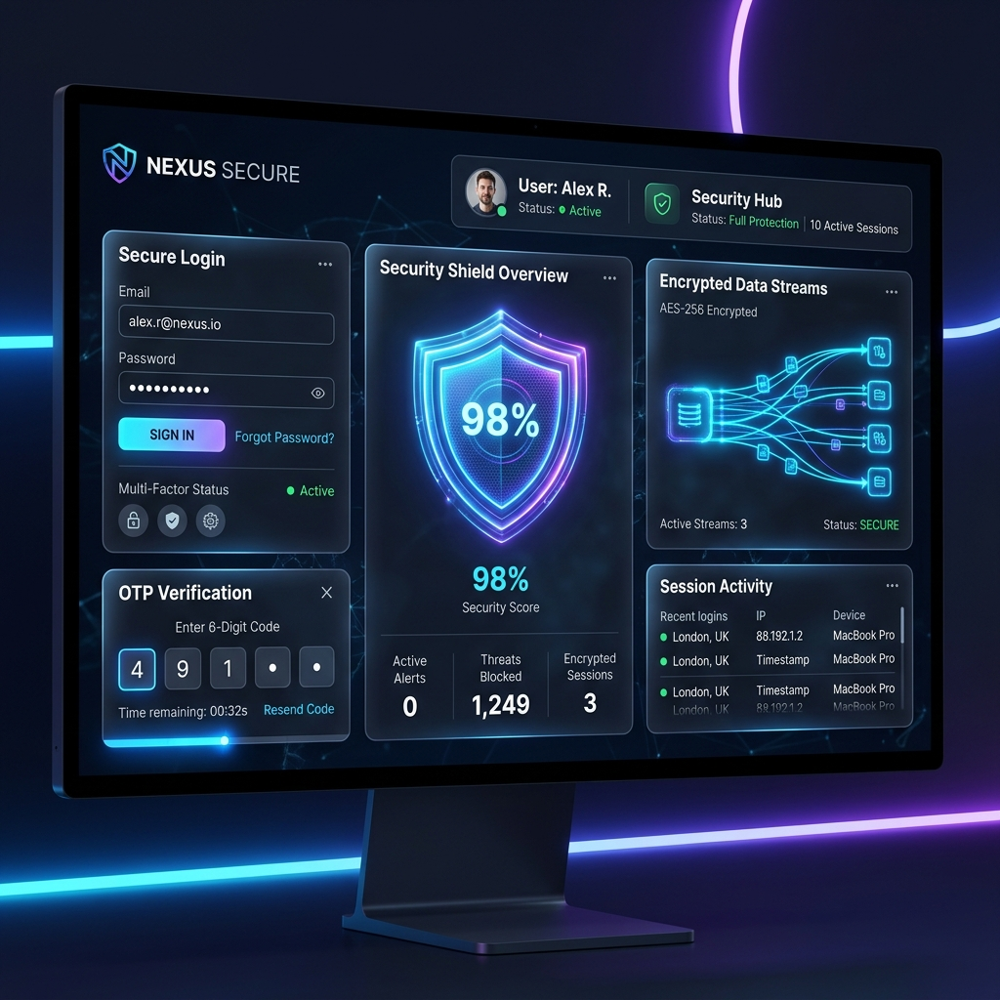

# Mohit Sharma - Personal Portfolio

 <!-- Update preview image later if needed -->

## 🚀 About the Project
A premium, highly interactive personal portfolio showcasing my journey, projects, and skills as a Full Stack Developer. Designed with a sleek dark theme, glassmorphism UI, and smooth scroll animations to deliver a cutting-edge web experience.

## ✨ Features
- **Modern & Premium Design**: Custom cursors, magnetic buttons, and interactive hover effects.
- **Advanced Animations**: Powered by GSAP and Framer Motion for a fluid, cinematic feel.
- **Performance Optimized**: Lazy loaded components, optimized image rendering, and smooth infinite marquees.
- **Command Palette**: A quick, developer-friendly navigation menu (Press `CTRL+K`).
- **Fully Responsive**: Flawless experience across mobile, tablet, and desktop devices.

## 🛠️ Tech Stack
- **Frontend Framework**: React.js, Vite
- **Styling**: Tailwind CSS
- **Animations**: GSAP, Framer Motion, Lenis (Smooth Scrolling)
- **Icons**: Phosphor Icons
- **Deployment Ready**: Vercel configuration included

## 💻 Running Locally

To get a local copy up and running, follow these simple steps:

1. **Clone the repo**
   ```bash
   git clone https://github.com/mohitshxrma45/Portfolio.git
   ```
2. **Install dependencies**
   ```bash
   npm install
   ```
3. **Run the development server**
   ```bash
   npm run dev
   ```

## 📬 Contact
Mohit Sharma - [iammohitpandit52@gmail.com](mailto:iammohitpandit52@gmail.com)

Project Link: [https://github.com/mohitshxrma45/Portfolio](https://github.com/mohitshxrma45/Portfolio)
